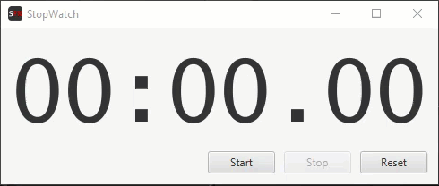
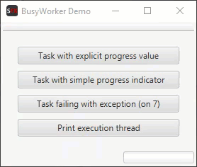
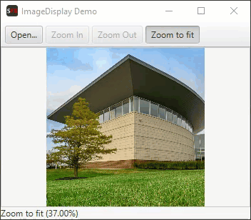

ScalaFX Extras
==============

[](https://travis-ci.org/scalafx/scalafx-extras)
[](https://maven-badges.herokuapp.com/maven-central/org.scalafx/scalafx-extras_2.13)
[](http://javadoc-badge.appspot.com/org.scalafx/scalafx-extras_2.13)

ScalaFX Extras are additions to ScalaFX that simplify creation of User interfaces. 
In contrast to ScalaFX core, the Extras do not have direct corresponding concepts in JavaFX. 

**Contents**

0. [Project Structure](#project-structure)
0. [SBT](#sbt)
0. [Features](#features)
   1. [Helper Methods](#helper-methods)
   1. [Simpler Display of Dialogs](#simpler-display-of-dialogs)
   1. [BusyWorker](#busyworker)
   1. [Simpler Use of FXML with MVCfx Pattern](#simpler-use-of-fxml-with-mvcfx-pattern)
   1. [Image Display Component](#imagedisplay-component)
0. [Demos](#demos)
   1. [StopWatch Application](#stopwatch-application)
   1. [ShowMessage Demo](#showmessage-demo)
   1. [BusyWorker Demo](#busyworker-demo)
   1. [ImageDisplay Demo](#imagedisplay-demo)
0. [Status](#status)
0. [Discussion and Support](#discussion-and-support)
0. [License](#license)

Project Structure
-----------------

Module `scalafx-extras` contain feature implementations.
Module `scalafx-extras-demos` illustrates use of `scalafx-extras`

SBT
---

To use ScalaFX Extras with SBT add following dependency:

```
libraryDependencies += "org.scalafx" %% "scalafx-extras" % scalafx_extras_version
```

The latest published ScalaFX Extras version: [](https://maven-badges.herokuapp.com/maven-central/org.scalafx/scalafx-extras_2.12)

Features
--------

### Helper Methods

Package `org.scalafx.extras` contains basic helper methods for running tasks on threads and showing exception messages.
The main helper methods:

* `onFX` run code on FX Application thread in parallel
* `onFXAndWait` run code on FX Application thread and wait till finished
* `offFX` run code a thread in parallel
* `offFXAndWait` run code a thread and wait till finished
* `showException` show an exception dialog

Example scheduling some code on FX Application thread
```scala
onFX {
    counterService.doResume()
    _running.value = true
}

```

Example execution some code on a separate thread and waiting for the result of computation
```scala
val x = offFXAndWait {
    val a = 3
    val b = 7
    a * b
}

```

### Simpler Display of Dialogs

The mixin `ShowMessage` makes it easier to display dialogs. It is typically used with a UI `Model`. 
The dialogs can be displayed using a single method, like `showInformation`, `showConfirmation`. `ShowMessage` takes care of blocking parent windows and using parent icons in dialogs. It can also log warnings, errors, and exceptions when warnings, errors, and exceptions dialogs are displayed. 

```scala
class MyUIModel extends Model with ShowMessage {

  def onSomeUserAction(): Unit = {
    // ...
    showInformation("Dialog Title",
      "This is the information \"header\"",
      "This is the information detailed \"content\".")
    // ...
  }
  
  // ...
}
```  
The demos module has a complete example of an simple application in `ShowMessageDemoApp`.

### BusyWorker

BusyWorker helps running a UI task on separate threads (other than the JavaFX Application thread). It will show busy
cursor and disable specified nodes while the task is performed. It gives an option to show progress and status messages.
`BusyWorker` takes care of handling exceptions and displaying error dialogs. It provides for an option to perform custom
finish actions after task is completed.

#### Example 1

Below is a simple example of using `BusyWorker`. 
When the task is running, `BusyWorker` will disable the root pane of the `parentWindow` to indicate that a task is performed.
It will also change the cursor in the root pane to "busy". 
When task is done, the cursor will be changed back to default and root pane will be enabled back.

```scala
new BusyWorker("Simple Task", parentWindow).doTask { () =>
  Thread.sleep(1000)
  print(1 + 1)
}
```

#### Examnple 2

Here is a little more elaborated example. It updates a progress message and progress indicator.
```scala
  val buttonPane: Pane = ...
  val progressLabel: Label = ...
  val progressBar: ProgressBar = ...

  val busyWorker = new BusyWorker("BusyWorker Demo", buttonPane) {
    progressLabel.text <== progressMessage
    progressBar.progress <== progressValue
  }

  val button = new Button("Click Me") {
        onAction = () => busyWorker.doTask("Task 1")(
          new SimpleTask[String] {
            override def call(): String = {
              val maxItems = 10
              for (i <- 1 to maxItems) {
                println(i)
                message() = s"Processing item $i/$maxItems"
                progress() = (i - 1) / 10.0
                Thread.sleep(250)
              }
              progress() = 1
              "Done"
            }
          }
        )
  }
```
The full code example can be found in the 
[BusyWorkerDemo][BusyWorkerDemo].


### Simpler Use of FXML with MVCfx Pattern

Package `org.scalafx.extras.mvcfx` contains classes for creating with UI components based on FXML.

The demos module has a complete example of a simple application: [StopWatchApp][StopWatchDemo].

### ImageDisplay Component

ImageDisplay Component is an image view with ability to zoom in, zoom out, zoom to fit. It can also automatically resize
to parent size.


Demos
-----

Module [scalafx-extras-demos][scalafx-extras-demos] contains examples of using ScalaFX Extras.

### StopWatch Application

[StopWatchApp][StopWatchDemo] is an application that illustrates uses of the MVCfx: a Model-Controller and SFXML/FXML API.



### ShowMessage Demo

[ShowMessageDemoApp][ShowMessageDemo] is a full example of using `ShowMessage` and MVCfx.


### BusyWorker Demo

[BusyWorkerDemo][BusyWorkerDemo] illustrated different aspects of using `BusyWorker`.



### ImageDisplay Demo

[ImageDisplayDemoApp][ImageDisplayDemo] a simple example of an application that can display images, 
with ability to zoom in, zoom out, and fit to current window. Illustrates use of the `ImageDisplay` component.



Status
------

ScalaFX Extras is still quite experimental and APIs may change significantly.

Discussion and Support
----------------------

For discussion and support, please use [ScalaFX Users Group](https://groups.google.com/forum/#!forum/scalafx-users) 
or [ScalaFX on StackOverflow](https://stackoverflow.com/questions/tagged/scalafx).
Please report issues using the projects Issue tracker.


License
-------

BSD-3-Clause ScalaFX license.

[scalafx-extras-demos]: scalafx-extras-demos
[BusyWorkerDemo]: scalafx-extras-demos/src/main/scala/org/scalafx/extras/BusyWorkerDemo.scala
[ImageDisplayDemo]: scalafx-extras-demos\src\main\scala\org\scalafx\extras\image\ImageDisplayDemoApp.scala
[ShowMessageDemo]: scalafx-extras-demos\src\main\scala\org\scalafx\extras\showmessage
[StopWatchDemo]: scalafx-extras-demos\src\main\scala\org\scalafx\extras\mvcfx\stopwatch