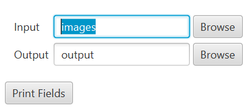
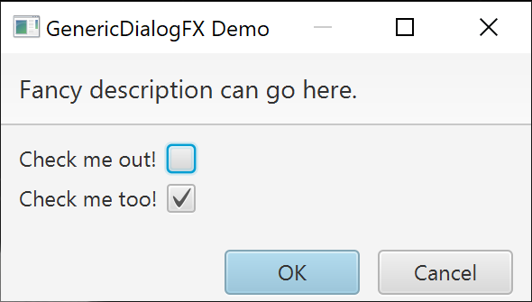
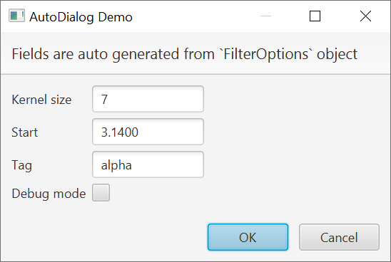

ScalaFX Extras
==============

[](https://github.com/scalafx/scalafx-extras/actions/workflows/scala.yml)
[](https://maven-badges.herokuapp.com/maven-central/org.scalafx/scalafx-extras_3)
[](https://javadoc.io/doc/org.scalafx/scalafx-extras_3)

ScalaFX Extras are additions to ScalaFX that simplify creation of User interfaces. In contrast to ScalaFX core, the
Extras do not have direct corresponding concepts in JavaFX.

**Contents**

<!-- TOC -->
  * [Project Structure](#project-structure)
  * [SBT](#sbt)
  * [Features](#features)
    * [Helper Methods](#helper-methods)
    * [Simpler Display of Standard Dialogs](#simpler-display-of-standard-dialogs)
    * [Easy Custom Panes](#easy-custom-panes)
    * [Easy Custom Dialogs](#easy-custom-dialogs)
    * [Edit a Case Class object with AutoDialog](#edit-a-case-class-object-with-autodialog)
    * [BusyWorker](#busyworker)
      * [Example 1](#example-1)
      * [Example 2](#example-2)
    * [Simpler Use of FXML with MVCfx Pattern](#simpler-use-of-fxml-with-mvcfx-pattern)
    * [ImageDisplay Component](#imagedisplay-component)
    * [Batch Processing and Progress Dialog](#batch-processing-and-progress-dialog)
  * [Demos](#demos)
    * [StopWatch Application](#stopwatch-application)
    * [ShowMessage Demo](#showmessage-demo)
    * [BusyWorker Demo](#busyworker-demo)
    * [ImageDisplay Demo](#imagedisplay-demo)
  * [Status](#status)
  * [Discussion and Support](#discussion-and-support)
  * [License](#license)
<!-- TOC -->

Project Structure
-----------------

Module `scalafx-extras` contain feature implementations. Module `scalafx-extras-demos` illustrates use
of `scalafx-extras`

SBT
---

To use ScalaFX Extras with SBT add following dependency:

```
libraryDependencies += "org.scalafx" %% "scalafx-extras" % scalafx_extras_version
```

The latest published ScalaFX Extras
version: [](https://maven-badges.herokuapp.com/maven-central/org.scalafx/scalafx-extras_2.12)

Features
--------

### Helper Methods

Package `org.scalafx.extras` contains basic helper methods for running tasks on threads and showing exception messages.
The main helper methods:

* `onFX` run code on FX Application thread in parallel
* `onFXAndWait` run code on FX Application thread and wait till finished
* `offFX` run code a thread in parallel
* `offFXAndWait` run code a thread and wait till finished

Example scheduling some code on FX Application thread

```scala
onFX {
  counterService.doResume()
  _running.value = true
}

```

Example execution some code on a separate thread and waiting for the result of computation

```scala
val x = offFXAndWait {
  val a = 3
  val b = 7
  a * b
}

```

### Simpler Display of Standard Dialogs

Standard dialogs can be quickly displayed using functions provided my `ShowMessage`. For instance,

```scala
import org.scalafx.extras.ShowMessage

ShowMessage.information(
  "Dialog Title",
  "This is the information 'header'",
  "This is the information detailed 'content'.",
  parentWindow
)
```

Dialog types supported:

* `confirmation`
* `confirmationYesNoCancel`
* `error`
* `exception`
* `information`
* `warning`

`ShowMessage` can be also used as a mixin to be used within a class where there is the same `parentWindow`.
It is typically used with a UI `Model`. The dialogs can be
displayed using a single method, like `showInformation`, `showConfirmation`. `ShowMessage` takes care of blocking parent
windows and using parent icons in dialogs. It can also log warnings, errors, and exceptions when warnings, errors, and
exceptions dialogs are displayed.

```scala
class MyUIModel extends Model with ShowMessage {

  def onSomeUserAction(): Unit = {
    // ...
    showInformation("Dialog Title",
      "This is the information 'header'",
      "This is the information detailed 'content'.")
    // ...
  }

  // ...
}
```  

The demos module has a complete example of a simple application in `ShowMessageDemoApp`.

### Easy Custom Panes

`GenericPane` is a helper class that simplifies creation of panes. Particularly suited for creation of input controls.

Typically there are 4 steps to using a `GenericPane`:

1. Creation, where elements of the pane are appended vertically using `add*(...)` methods, for instance,
   `addStringField(label, defaultText)`

2. Adding the pane to the UI

3. User interaction, after the pane is displayed

4. Optionally, reading of input. Pane's editable content can be read using `next*()` methods. Content is read in the
   order it is added. The whole pane content can be read multiple tiles. Remember to call `resetReadout()` to ensure
   that reading is restarted from the beginning of the pane.

A complete example in Scala 3. Shows a pane with 2 directory selection fields and a button "Print Fields". When the
button is pressed values
of the directory fields are printed

```scala 3
import org.scalafx.extras.generic_pane.GenericPane
import scalafx.application.JFXApp3
import scalafx.application.JFXApp3.PrimaryStage
import scalafx.geometry.Insets
import scalafx.scene.Scene
import scalafx.scene.control.Button
import scalafx.scene.layout.VBox

object GenericPaneDemo extends JFXApp3:

  override def start(): Unit =

    val gp = new GenericPane():
      addDirectoryField("Input", "images")
      addDirectoryField("Output", "output")

    stage = new PrimaryStage:
      title = "GenericPane Demo"
      scene = new Scene:
        content = new VBox:
          padding = Insets(7, 7, 7, 7)
          spacing = 7
          children = Seq(
            gp.pane,
            new Button("Print Fields"):
              onAction = (_) =>
                gp.resetReadout()
                println(s"Input dir : ${gp.nextString()}")
                println(s"Output dir: ${gp.nextString()}")
          )
```



### Easy Custom Dialogs

Custom dialogs can be quickly created using `GenericDialogFX` class. This class is particularly suited for creation of
input dialogs.

There are 3 steps to using the `GenericDialogFX`:

1. Creation, where elements of the dialog are appended vertically using `add*(...)` methods, for
   instance,`addStringField(label, defaultText)`
2. User interaction, dialog is displayed using `showDialog()` method
3. Reading of input, once the dialog is closed, dialog content can be read using `next*()` methods. Content is read in
   the order it is added.

Here is en example:

```scala
// Create a dialog
val dialog =
  new GenericDialogFX(
    title = "GenericDialogFX Demo",
    header = "Fancy description can go here."
  ) {
    // Add fields
    addCheckbox("Check me out!", defaultValue = false)
    addCheckbox("Check me too!", defaultValue = true)
  }

// Show dialog to the user
dialog.showDialog()

// Read input provided by the user
if (dialog.wasOKed) {
  val select1 = dialog.nextBoolean()
  val select2 = dialog.nextBoolean()

  println(s"Selection 1: $select1")
  println(s"Selection 2: $select2")
} else {
  println("Dialog was cancelled.")
}
```



A more elaborate example is in the `GenericDialogFXDemo`.

### Edit a Case Class object with AutoDialog

`AutoDialog` can be used too quickly open auto generated dialog from case class. After closing, the dialog will return
edited version of the input case class.

Here is an example of usage:

```scala
import org.scalafx.extras.auto_dialog.AutoDialog

case class FilterOptions(kernelSize: Int = 7,
                         start: Double = 3.14,
                         tag: String = "alpha",
                         debugMode: Boolean = false)

val filterOptions = FilterOptions()

val result: Option[FilterOptions] =
  new AutoDialog(filterOptions)
    .showDialog(
      "AutoDialog Demo",
      "Fields are auto generated from `FilterOptions` object")

println(s"Result: $result")
```



### BusyWorker

BusyWorker helps running a UI task on separate threads (other than the JavaFX Application thread). It will show busy
cursor and disable specified nodes while the task is performed. It gives an option to show progress and status messages.
`BusyWorker` takes care of handling exceptions and displaying error dialogs. It provides for an option to perform custom
finish actions after task is completed.

#### Example 1

Below is a simple example of using `BusyWorker`. When the task is running, `BusyWorker` will disable the root pane of
the `parentWindow` to indicate that a task is performed. It will also change the cursor in the root pane to "busy". When
task is done, the cursor will be changed back to default and root pane will be enabled back.

```scala
new BusyWorker("Simple Task", parentWindow).doTask { () =>
  Thread.sleep(1000)
  print(1 + 1)
}
```

#### Example 2

Here is a little more elaborated example. It updates a progress message and progress indicator.

```scala
val buttonPane: Pane = ???
val progressLabel: Label = ???
val progressBar: ProgressBar = ???

val busyWorker = new BusyWorker("BusyWorker Demo", buttonPane) {
  progressLabel.text <== progressMessage
  progressBar.progress <== progressValue
}

val button = new Button("Click Me") {
  onAction = () => busyWorker.doTask("Task 1")(
    new SimpleTask[String] {
      override def call(): String = {
        val maxItems = 10
        for (i <- 1 to maxItems) {
          println(i)
          message() = s"Processing item $i/$maxItems"
          progress() = (i - 1) / 10.0
          Thread.sleep(250)
        }
        progress() = 1
        "Done"
      }
    }
  )
}
```

The full code example can be found in the
[BusyWorkerDemo][BusyWorkerDemo].

### Simpler Use of FXML with MVCfx Pattern

Package `org.scalafx.extras.mvcfx` contains classes for creating with UI components based on FXML that use
Model-View-Controller, here we call it the MVCfx Pattern. See wiki page [MVCfx Pattern] for details.

The demos module has a complete example of a simple application: [StopWatchApp][StopWatchDemo].

### ImageDisplay Component

ImageDisplay Component is an image view with the ability to zoom in, zoom out, zoom to fit. It can also automatically resize
to parent size.

### Batch Processing and Progress Dialog

Work in progress
* Helper UI for running batch processing tasks, see `BatchRunnerProgressHelperDemoApp` for example of use
* Component for display of progress of batch processing tasks, see `ProgressStatusDemoApp` for example of use


Demos
-----

Module [scalafx-extras-demos][scalafx-extras-demos] contains examples of using ScalaFX Extras.

### StopWatch Application

[StopWatchApp][StopWatchDemo] is an application that illustrates uses of the [MVCfx Pattern]: a Model-View-Controller
with FXML layout.


There are slight differences between Scala 2 and 3 related to use of annotations. See [StopWatchDemo Scala 2]
and [StopWatchDemo Scala 3] files for details. It is described in details in [MVCfx Pattern] wiki page.

### ShowMessage Demo

[ShowMessageDemoApp][ShowMessageDemo] is a full example of using `ShowMessage` and MVCfx.


There are slight differences between Scala 2 and 3 related to use of annotations. See [ShowMessageDemo Scala 2]
and [ShowMessageDemo Scala 3] files for details.

### BusyWorker Demo

[BusyWorkerDemo][BusyWorkerDemo] illustrated different aspects of using `BusyWorker`.


### ImageDisplay Demo

[ImageDisplayDemoApp][ImageDisplayDemo] a simple example of an application that can display images, with ability to zoom
in, zoom out, and fit to current window. Illustrates use of the `ImageDisplay` component.


Status
------

ScalaFX Extras is still quite experimental and APIs may change significantly.

Discussion and Support
----------------------

For discussion and support, please use [ScalaFX Users Group]
or project [Discussions]. Please report issues using the projects Issue tracker.


License
-------

BSD-3-Clause ScalaFX license.

[scalafx-extras-demos]: scalafx-extras-demos

[MVCfx Pattern]: https://github.com/scalafx/scalafx-extras/wiki/MVCfx-Pattern

[BusyWorkerDemo]: scalafx-extras-demos/src/main/scala/org/scalafx/extras/BusyWorkerDemo.scala

[ImageDisplayDemo]: scalafx-extras-demos/src/main/scala/org/scalafx/extras/image/ImageDisplayDemoApp.scala

[ShowMessageDemo]: scalafx-extras-demos/src/main/scala/org/scalafx/extras/showmessage

[ShowMessageDemo Scala 2]: scalafx-extras-demos/src/main/scala-2/org/scalafx/extras/showmessage

[ShowMessageDemo Scala 3]: scalafx-extras-demos/src/main/scala-3/org/scalafx/extras/showmessage

[StopWatchDemo]: scalafx-extras-demos/src/main/scala/org/scalafx/extras/mvcfx/stopwatch

[StopWatchDemo Scala 2]: scalafx-extras-demos/src/main/scala-2/org/scalafx/extras/mvcfx/stopwatch

[StopWatchDemo Scala 3]: scalafx-extras-demos/src/main/scala-3/org/scalafx/extras/mvcfx/stopwatch

[ScalaFX Users Group]: https://groups.google.com/forum/#!forum/scalafx-users

[Discussions]: https://github.com/scalafx/scalafx-extras/discussions